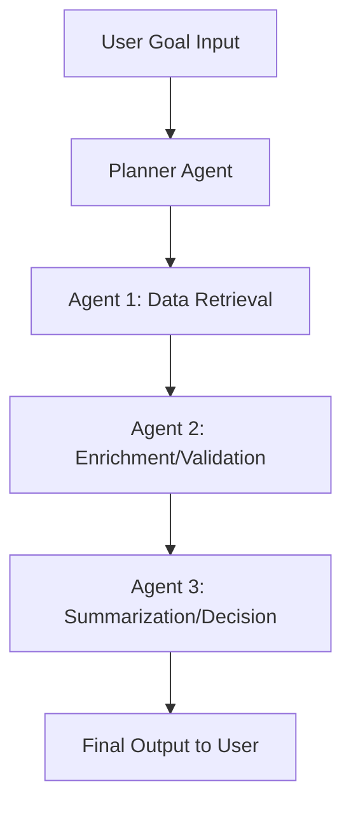

# 🚀 Multi-Agent AI System using Google ADK

## 📌 Project Overview

This project implements a **multi-agent AI system** using Google ADK (Agent Development Kit). It takes a natural language goal from the user, generates a plan, and executes a sequence of intelligent agents that collaboratively work to fulfill the objective.

Each agent builds on the previous one’s output, ensuring **inter-agent dependency, planning, and iteration**. The system can handle goals like:

> “Find the next SpaceX launch, check weather at that location, then summarize if it may be delayed.”

---

## 🔍 Use Case Examples

### ✅ Goal:
> Get the current price of Bitcoin and summarize recent sentiment

#### ✨ Output:
- Bitcoin price: $105,126  
- News Headlines: 5 recent articles  
- Market Sentiment: 😐 Neutral

---

### ✅ Goal:
> Get the date and summary of the next SpaceX launch

#### ✨ Output:
- Mission: Galaxy 33 & 34  
- Rocket: Falcon 9  
- Launchpad: CCSFS SLC 40  
- Location: Latitude 28.56, Longitude -80.57  
- Launch Date: 2022-10-08 (🔁 outdated, see improvements below)

---

## 🧠 System Architecture



- **Planner Agent**: Parses the goal and sequences the task pipeline.  
- **Retrieval Agent**: Calls APIs like SpaceX, CoinGecko, or NewsAPI.  
- **Weather Agent**: Pulls weather data for the launch site using OpenWeatherMap.  
- **Evaluation Agent**: Analyzes risk of delay and formats the summary.

---

## ⚙️ How It Works

The system takes a goal as input and automatically:

1. Parses and interprets the goal  
2. Creates a multi-step plan involving dependent agents  
3. Agents interact with external APIs and process the data  
4. Returns a context-aware, final answer to the user  

### Supported APIs:
- SpaceX API  
- OpenWeatherMap API  
- CoinGecko API  
- NewsAPI  

---

## 🌟 Features

- Developed with **FastAPI** and deployable in **Google Colab** using **Ngrok**  
- Agents are capable of inter-communication, chaining tasks, and resolving complex goals  
- Compatible with external APIs like:
  - SpaceX Launch Data ([SpaceX API](https://github.com/r-spacex/SpaceX-API))  
  - Weather Forecast ([OpenWeatherMap API](https://openweathermap.org/api))  
  - Bitcoin Price Checker ([CoinGecko API](https://www.coingecko.com/))  
- Built-in Evaluation Tracking via FastAPI endpoints  

---

## 🛠 Technologies Used

- Python  
- FastAPI  
- Ngrok (for exposing Colab endpoints)  
- Requests (for API calls)  

---

## 📦 Installation

> All setup is designed to run inside a Google Colab notebook.

1. Upload `.env.txt` file containing your API keys (e.g., NewsAPI, OpenWeatherMap)

```bash
API_KEY=your_api_key_here
```

2. Start the FastAPI server:

```python
!uvicorn main:app --reload --port 8000 &
```

3. Run Ngrok to expose the server:

```python
from pyngrok import ngrok
public_url = ngrok.connect(8000)
print("🚀 FastAPI running at:", public_url)
```

4. Access the FastAPI Swagger UI:  
👉 [https://b660-35-233-131-53.ngrok-free.app/docs](https://b660-35-233-131-53.ngrok-free.app/docs)

---

## 🧪 Evaluation Examples

### 1. SpaceX Launch Delay Checker

```json
{
  "goal": "Get the date and summary of the next SpaceX launch"
}
```

**Expected Output:** Mission name, rocket, launch pad, weather at location, launch delay risk.

---

### 2. Bitcoin Price Checker

```json
{
  "goal": "Get the current Bitcoin price in INR"
}
```

**Expected Output:** Current price of Bitcoin in INR, possibly with % change or timestamp.

---

## ✅ How to Use

1. Go to [FastAPI Docs](https://b660-35-233-131-53.ngrok-free.app/docs)  
2. Click on `POST /evaluate`  
3. Click **Try it out** → Paste any of the above JSON goals → Click **Execute**  
4. View the output in real-time  

---

## 📂 Endpoints

| Method | Endpoint     | Description                      |
|--------|--------------|----------------------------------|
| POST   | /evaluate    | Evaluate a goal with multi-agent |
| GET    | /evaluations | View all past evaluations        |

---

## 👤 Author

**Aditya Kumar Pandey**  
MTech (AI & Data Science), IIIT Bhagalpur  

📧 [aditya.240201001@iiitbh.ac.in](mailto:aditya.240201001@iiitbh.ac.in)  
📞 +91 7858826847

---

⭐️ *Feel free to star this repo if you found it useful!*
